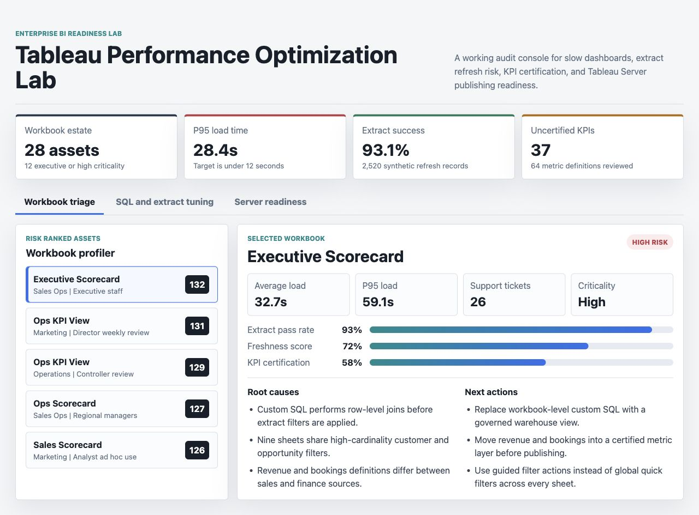
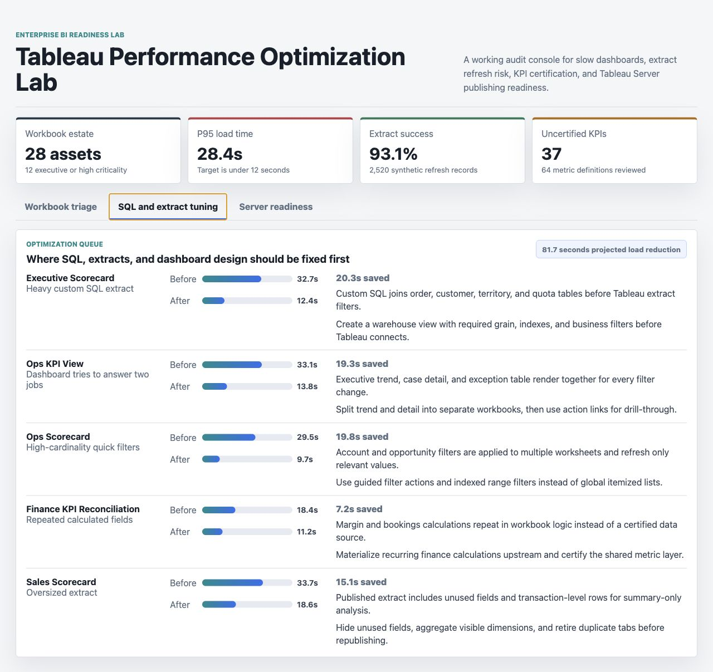
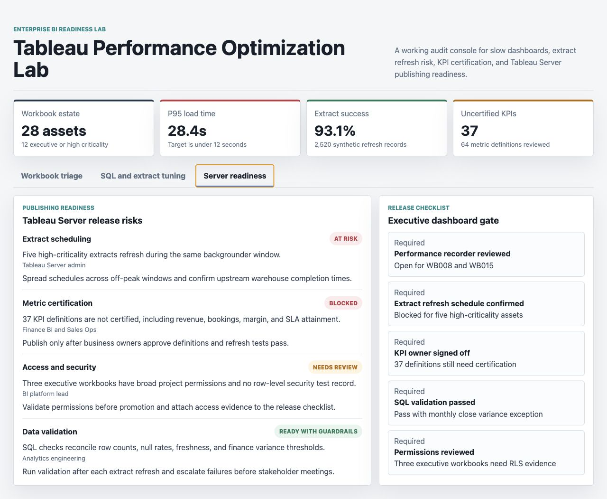

# Tableau Performance Optimization Lab

An enterprise BI portfolio artifact for Tableau dashboard performance, extract reliability, KPI certification, and Tableau Server publishing readiness.

This project is built around a common reporting problem: executive dashboards can look polished while still being expensive to operate. Slow load times, heavy custom SQL, stale extracts, unclear metric ownership, broad access rules, and recurring stakeholder tickets can make reporting unreliable at exactly the moment leaders need it.

## What This Artifact Demonstrates

- Tableau workbook performance triage across load time, p95 latency, support volume, extract health, and KPI certification.
- SQL and extract optimization thinking for large enterprise data environments.
- Tableau Server release discipline for schedules, permissions, validation, and metric owner sign-off.
- Stakeholder-ready communication that turns technical BI findings into publishing decisions.

## Surface 1: Workbook Triage



Caption: The workbook triage surface ranks Tableau assets by governance and performance risk. Selecting a workbook shows p95 load time, support tickets, extract pass rate, freshness, KPI certification, root causes, and next actions.

## Surface 2: SQL And Extract Tuning



Caption: The optimization queue translates slow-dashboard evidence into concrete fixes, including replacing workbook-level custom SQL, reducing oversized extracts, changing high-cardinality filters, and moving repeated calculations upstream.

## Surface 3: Server Publishing Readiness



Caption: The publishing readiness surface checks Tableau Server release gates before executive dashboards go live, including extract scheduling, metric certification, access review, row-level security evidence, and SQL validation.

## Data Strategy

The project uses synthetic enterprise BI operations data. It is not real company data.

Synthetic data is appropriate here because Tableau Server metadata, workbook names, user behavior, security groups, query patterns, and executive KPI definitions are usually confidential. The generated structure models a central BI team supporting executive dashboards and operational reporting over relational warehouse sources.

The data includes:

- `workbooks.csv`: 28 Tableau workbook assets with owner team, certification flag, and business criticality.
- `performance_samples.csv`: 3,200 load-time observations with filter count, visualization count, and user count. Slower workbooks are modeled with heavier filters, more visual density, and larger audiences.
- `extract_runs.csv`: 2,520 extract refresh records with run status, duration, row volume, and freshness lag.
- `support_tickets.csv`: 720 stakeholder tickets for access, stale data, KPI disputes, and performance complaints.
- `metric_definitions.csv`: 64 KPI definitions with source system, owner department, certification status, and definition age.
- `optimization_candidates.csv`: targeted tuning candidates with before and after load estimates.
- `publishing_readiness.csv`: release gate checks for Tableau Server scheduling, access, certification, and validation.

## Analysis Method

`scripts/score_operating_data.py` joins workbook inventory, performance samples, extract runs, support tickets, and KPI definitions. It writes `analysis/outputs/workbook_governance_risk.csv` and ranks assets using:

- Average load time.
- P95 load time.
- Stakeholder support tickets.
- Extract failure rate.
- Uncertified metric rate by owner team.
- Business criticality.

The scoring is deterministic rather than predictive because this artifact is designed for a Tableau Developer role. The goal is to show operational BI judgment, not to claim a machine learning model is needed where one is not.

## Role Connection

This artifact maps directly to Tableau Developer responsibilities:

- Designing interactive BI surfaces.
- Optimizing Tableau dashboards for performance and scalability.
- Working with large datasets and multiple data sources.
- Writing and validating SQL checks.
- Managing Tableau Server publishing, scheduling, and access readiness.
- Troubleshooting dashboard issues with clear stakeholder recommendations.

## Scope

What it does:

- Provides a working static Tableau operations console.
- Documents synthetic data assumptions.
- Includes analysis scripts, SQL checks, generated outputs, and three distinct UI surfaces.
- Shows how BI performance, governance, and publishing decisions connect.

What it does not do:

- Connect to a live Tableau Server instance.
- Use real company workbook logs or confidential reporting data.
- Publish actual Tableau workbooks.
- Claim the synthetic metrics represent real business performance.

## Repository Structure

- `index.html`: interactive Tableau performance and publishing readiness console.
- `src/`: UI data, rendering logic, and styling.
- `data/`: synthetic BI operations data and documentation.
- `analysis/`: methodology, SQL checks, executive findings, and generated scoring output.
- `scripts/score_operating_data.py`: deterministic workbook risk scoring script.
- `docs/images/`: screenshots for the three artifact surfaces.

## Run Locally

```bash
python3 -m http.server 4175
```

Then open `http://localhost:4175`.

If port 4175 is already in use, run another port:

```bash
python3 -m http.server 4180
```

## Run The Analysis

```bash
npm run analyze
```

The script writes the ranked workbook risk output to `analysis/outputs/workbook_governance_risk.csv`.

## Reference Practices

The artifact reflects Tableau performance and publishing guidance around extracts, filtering, custom SQL, workbook performance recording, and extract refresh schedules:

- [Tableau workbook performance checklist](https://help.tableau.com/current/pro/desktop/en-us/perf_checklist.htm)
- [Test your data and use extracts](https://help.tableau.com/current/pro/desktop/en-us/perf_extracts.htm)
- [Optimize for extracts](https://help.tableau.com/current/server/en-us/perf_optimize_extracts.htm)
- [Schedule extract refreshes as you publish a workbook](https://help.tableau.com/current/pro/desktop/en-us/publish_workbooks_schedules.htm)
