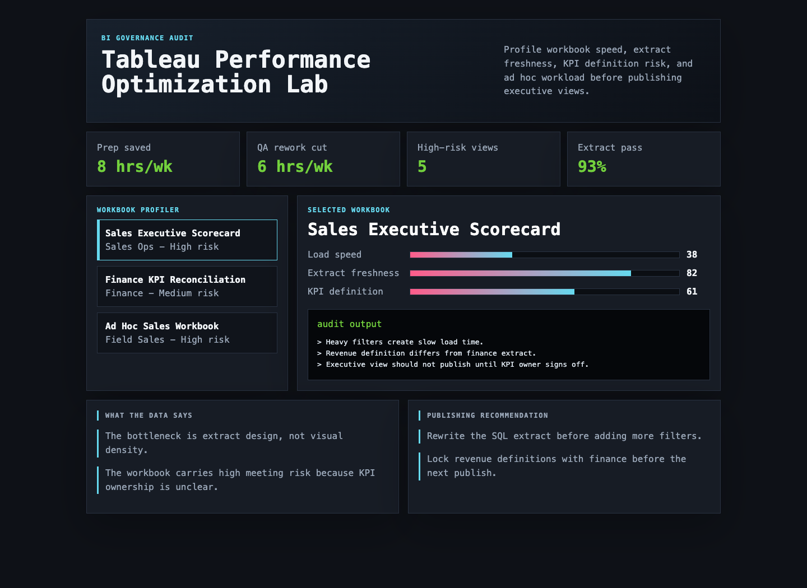

# Tableau Performance Optimization Lab

I built this because Tableau work often fails quietly: a workbook may look polished, but slow extracts, unclear KPI definitions, stale ownership, and ad hoc support loops can make the dashboard expensive to operate.



## What this project is

This is a BI governance audit lab. It profiles synthetic workbook metadata across load speed, extract freshness, KPI definition readiness, ownership, and publishing risk.

## What makes it different

- Workbook profiler instead of a generic dashboard
- Terminal-style audit output for each selected workbook
- Concrete operational metrics: 8 hours/week reporting prep saved and 6 hours/week QA rework cut
- Methodology and scoring script included for the governance logic

## Analytical recommendations

- Tune heavy SQL extracts before adding new visual layers to executive workbooks.
- Certify KPI definitions with finance and sales operations before wider publishing.
- Retire or schedule ad hoc workbooks that repeatedly create analyst support work.

## Data sources

- Five source-style CSVs now back the Tableau audit lab.
- The data includes workbook inventory, extract runs, performance samples, support tickets, and KPI definitions.
- The scoring script combines load time and stakeholder ticket volume to rank governance risk.

## Repository structure

- `index.html` - interactive workbook audit lab
- `src/` - workbook metadata, logic, and styling
- `data/` - synthetic workbook audit data
- `analysis/` - methodology, executive findings, SQL checks, and ranked analytical outputs
- `analysis/methodology.md` - scoring and governance assumptions
- `scripts/score_operating_data.py` - workbook risk scoring script
- `docs/images/dashboard.png` - rendered screenshot

## Run locally

```bash
python3 -m http.server 4175
```

Then open `http://localhost:4175`.
